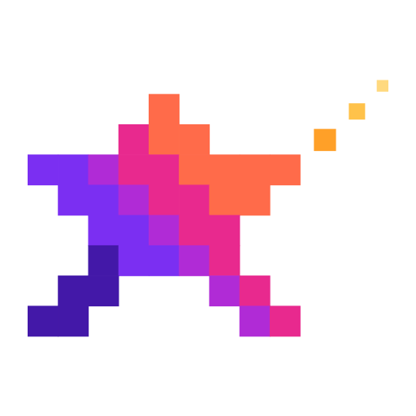
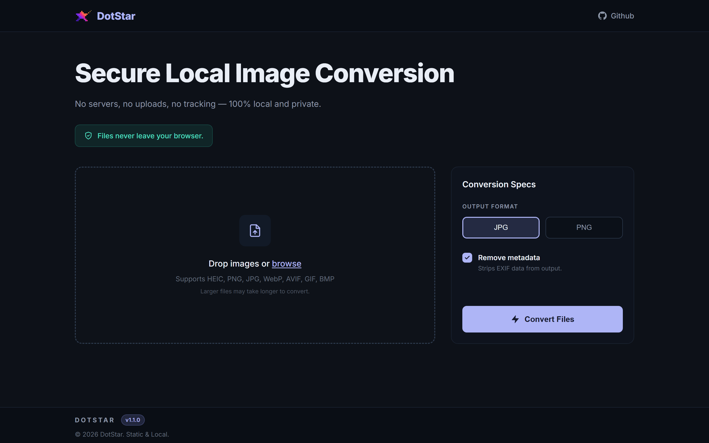

<div align="center">



# DotStar

**A lightweight image format converter that processes images locally in your browser — no uploads, tracking, or accounts required.**

[**Try it live →**](https://cr4vex.github.io/DotStar/)

[](LICENSE)


</div>



Drop in a HEIC, PNG or JPG, pick an output format, and convert. Every byte stays on your machine: there is no backend, no analytics, and nothing is ever sent anywhere.

## Why I Created DotStar

Most online image converters work the same way: you hand your files to a stranger's server, wait, and hope they delete them afterwards. For a holiday photo that might be fine. For a scanned document, an ID, or a screenshot with private information, it isn't.

Browsers have been able to decode and re-encode images on their own for years. DotStar is that idea taken to its conclusion — a converter with nowhere to send your files, because there is no server to send them to.

## Philosophy

| | |
| --- | --- |
| **Local only** | Conversion happens on a `<canvas>` in your tab. Files never leave the device. |
| **No build step** | Open `index.html` and it runs. No bundler, no install, no toolchain. |
| **Nearly no dependencies** | Plain HTML, CSS, and JavaScript, plus one vendored decoder that only HEIC files ever touch. |
| **Works offline** | Once the page is loaded, you can disconnect and keep converting. |

## Features

- Drag and drop files, or browse for them — multiple at a time
- Conversion queue with per-file progress, status, and before/after size
- Converts iPhone **HEIC** photos in every browser, including the ones with no HEIC support of their own
- Download files one by one, or all at once
- Remove any file from the queue, or clear the whole thing
- EXIF metadata is dropped as a side effect of re-encoding

### Formats

| | |
| --- | --- |
| **Reads** | HEIC · PNG · JPG · WebP · AVIF · GIF · BMP |
| **Writes** | JPG · PNG |

## HEIC Support

Apple has shipped HEIC — HEVC-compressed stills in a HEIF container — as the default camera format since iOS 11. Safari is the only browser that can read it, because the HEVC patent licensing keeps the decoder out of the others. So a plain `<canvas>` is not enough here.

DotStar handles it in two steps:

1. **Ask the browser first.** On Safari (macOS, iPhone, iPad) the photo decodes natively — nothing extra is loaded.
2. **Otherwise, decode it here.** Everywhere else, the file is sniffed for a HEIF brand in its `ftyp` box and handed to [libheif](https://github.com/strukturag/libheif) compiled to WebAssembly, bundled in `src/vendor/libheif/`.

The decoder is ~1.4 MB and is fetched **from this folder, on demand** — the first time you convert a HEIC and never otherwise. Rotation, color, and the primary image of multi-image files are handled by libheif itself, and the photo is still decoded entirely on your machine.

HEIC is read-only: no browser can encode it, so it is an input format, not an output one.

## Getting Started

Clone the repository and open the page:

```bash
git clone https://github.com/Cr4Vex/DotStar.git
cd DotStar
```

Then open `index.html` in your browser — that's the whole setup.

Some browsers restrict `file://` pages, so if anything misbehaves, serve the folder over HTTP instead:

```bash
python -m http.server 8000
```

and visit `http://localhost:8000`.

Because the project is fully static, it can also be published as-is with GitHub Pages (Settings → Pages → deploy from the `main` branch, root folder).

## Project Structure

```
DotStar/
├── index.html              # Markup for the whole page
└── src/
    ├── assets/             # Logo mark and favicon
    ├── css/
    │   └── styles.css      # Styles and theme variables
    ├── js/
    │   ├── ui.js           # DOM references and queue rendering
    │   ├── heic.js         # HEIC sniffing and on-demand libheif decoding
    │   ├── convert.js      # Canvas decode/encode and file download
    │   └── main.js         # Queue state and event wiring
    └── vendor/
        └── libheif/        # Vendored libheif WebAssembly decoder (LGPL-3.0)
```

## Limitations

- **Camera RAW is not supported.** Browsers ship no RAW decoder, so formats like CR2, NEF, ARW, and DNG cannot be read at all.
- **WebP and AVIF input depends on your browser.** Both decode in current Chrome, Edge, Firefox, and Safari; older versions may fail.
- **HEIC cannot be written.** No browser can encode HEIC, and the bundled libheif build is a decoder only, so HEIC is input-only.
- **HEIC is slower.** A 12 MP photo takes roughly a second to decode in WebAssembly, and the tab is busy while it does.
- **Only the primary image of a HEIC is converted.** Bursts, Live Photos, and depth or auxiliary images are ignored.
- **Animated GIFs lose their animation.** Canvas has no concept of frames, so only the first one is converted.
- **JPG has no transparency.** Converting a transparent PNG to JPG flattens the transparent areas onto white.
- Very large images are limited by the browser's canvas size and available memory.

## Author

Created by **Cr4Vex** — [github.com/Cr4Vex](https://github.com/Cr4Vex)

## License

Licensed under the MIT License. See [LICENSE](LICENSE) for details.

The bundled HEIC decoder in `src/vendor/libheif/` is not covered by that license: it is an unmodified build of [libheif](https://github.com/strukturag/libheif), distributed under the **LGPL-3.0**. Its license and provenance are in [src/vendor/libheif/](src/vendor/libheif/).
